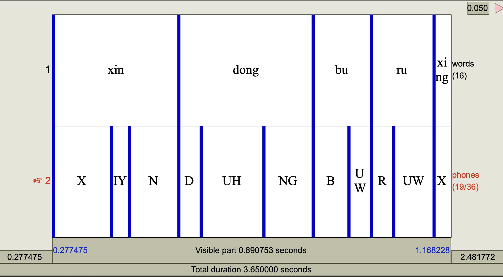
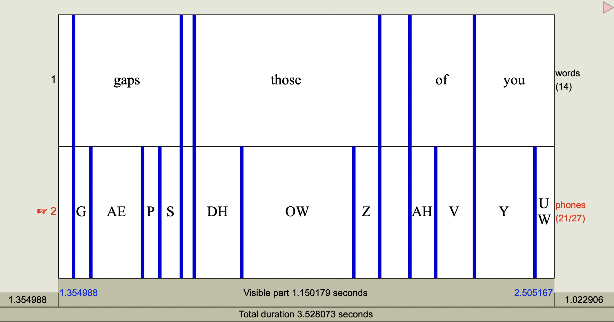

# data adpatation

In our experiment, we use three datasets: M4Singer (originally on pinyin phoneme set), DB-4 (without phoneme level labels), and NUS-48E (originally based on CMU-phoneme set). To achive our data apdatstions, we have different procedures for the three corpora.
- for M4Singer, we try two approches:
    - simply split each phoneme in the Pinyin set into its corresponding CMU phonemes, average the original phoneme duration and assign to corresponding CMU phonemes.
    - train new MFA acoustic model on this dataset with CMU prnounciation dictionary for Chinese; then proportionally distribute the original duration (pinyin based) according to the ratio obtained in the MFA alignment result.
- for DB-4, there are CN and EN data, we also train new MFA acoustic model on each dataset, get adequately accurate MFA alignment results, which means reliable duration at phoneme level. Due to the lack of music note for this speech dataset, based on the alignment result, we get word boundaries and use [Parselmouth](https://parselmouth.readthedocs.io/en/stable/api_reference.html#parselmouth.Sound.to_pitch_cc) to detect pitch for each word, resulting in music note for SVS.
    - Further augmenting the speech data for SVS task, we adopt the pitch shifting strategy, which only changing the pitch without affecting duration.
- for NUS-48E, ...

## for M4Singer
Heavily rely on the M4Singer origin annotation `meta.json`.

### straightforward split and average
We mannually map the pinyin phoneme to the CMU phonemes, see `assets/pinyin_cmu_map.txt` for more details.

Run `utils/get_meta_m4_avg.py` to get structured metadata `data/meta/m4-avg.json`.

### proportionally distribute based on MFA alignment
Due to the mismatch between the original `.TextGrid` and meta information in `meta.json`, initially run `utils/adjust_m4_ori_meta.py` to adjust the original `meta.json` according to the original `.TextGrid`, yielding `data/meta/m4-adjust-ori.json`.

The proportional distribution basically execute at the yunmu partition between the original `.TextGrid` provided by M4Singer and our MFA alignment result `.TextGrid`. Run `utils/get_meta_m4_proportional.py` to get structured metadata `data/meta/m4-proportional.json`.

## for DB-4
### get structured metadata
After the MFA training and alignment, we get the results like this:

Targeting CN database, run `utils/get_meta_db4cn_wdb.py` to get structured metadata `data/meta/db4cn-wdb.json`; for EN database, run `utils/get_meta_db4en-wdb.py` to get structured metadata `data/meta/db4en-wdb.json`.

### pitch shift

Run `utils/pitch_shift.py`, derive corresponding structured metadata `data/meta/db4cn-shift-wdb.json` and `data/meta/db4en-shift-wdb.json`

